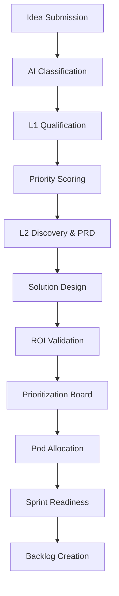

# Automation Opportunity Intake Hub: Executive Presentation & Process Walkthrough

*A comprehensive guide for Business Stakeholders, COE Leaders, Process Owners, and Executives*

---

## Slide 1: Transforming Automation Intake from Chaos to Value
**Automation Opportunity Intake Hub — Executive Review**

> [!NOTE] 
> **Speaker Notes:** Welcome everyone. Today, we are reviewing our new Automation Opportunity Intake Hub—a strategic platform designed to bridge the gap between raw business ideas and tangible automation value. We will explore how this platform standardizes our intake process, ensures we invest in the right technologies, and accelerates our time-to-value.

---

## Slide 2: The Business Problem
**The Challenge: "We have hundreds of automation ideas, but where do we start?"**

In the current landscape, organizations face several critical challenges:
- **Idea Clutter:** Numerous ideas are submitted via emails, spreadsheets, and informal chats without standardized documentation.
- **Misaligned Technology:** Ideas are often matched with the wrong technology (e.g., using RPA for a process that requires GenAI).
- **Subjective Prioritization:** Investments are driven by "who shouts loudest" rather than objective ROI and strategic alignment.
- **Delivery Bottlenecks:** Development teams receive "half-baked" ideas lacking proper discovery, leading to stalled sprints and scope creep.

> [!NOTE] 
> **Speaker Notes:** We all know the pain of managing an automation pipeline today. Business units are eager to automate, but the COE is overwhelmed with unstructured requests. Without a standardized process to evaluate feasibility and calculate ROI upfront, we risk wasting valuable development cycles on low-value or technically unfeasible projects.

---

## Slide 3: The Solution — An AI-Driven Intake Pipeline
**Standardized, Objective, and Sprint-Ready**

The Automation Opportunity Intake Hub is a centralized platform that transforms raw ideas into qualified, prioritized, ROI-backed, sprint-ready delivery items through a standardized 11-stage AI-driven lifecycle.

> [!NOTE] 
> **Speaker Notes:** To solve this, we built a 11-stage pipeline. This isn't just a tracking tool; it's an intelligent engine. It automatically classifies ideas, scores them based on impact, forces rigorous discovery, validates the business case, and ensures that by the time an idea hits our development pods, it is 100% ready to be built.

---

## Slide 4: Stage 1 — Idea Submission
**Capturing the "Why" and "What"**

- **Business Objective:** Standardize the capture of automation ideas from across the enterprise.
- **Activities:** Business users complete a guided 4-step wizard capturing process characteristics, pain points, and current manual metrics.
- **Outputs:** A structured draft opportunity with baseline metrics (time/cost savings).
- **Value Delivered:** Lowers the barrier to entry for business users while ensuring the COE receives standardized, high-quality data.

> [!NOTE] 
> **Speaker Notes:** It all starts with the Business User. We've replaced complex intake forms with an intuitive wizard. We ask simple questions: How many hours are you spending? What systems are involved? Is the data structured? This ensures we capture the critical data needed for the next automated steps without overwhelming the user.

---

## Slide 5: Stage 2 — Automation Type Classification
**Matching the Right Tool to the Right Job**

- **Business Objective:** Eliminate guesswork in technology selection.
- **Process:** The AI engine analyzes the process characteristics (e.g., autonomy level, data structure, reasoning needs).
- **Decisions:** Automatically routes the idea into one of four distinct tracks:
  1. **Hyperautomation/Agentic Automation** (High autonomy, multi-system orchestration, GenAI)
  2. **RPA** (Rule-based, structured data, deterministic)
  3. **Intelligent Automation** (Document understanding, unstructured data, cognitive reasoning)
  4. **Power Platform** (Workflow-centric, API-driven)
- **Value Delivered:** Prevents costly architectural mistakes by ensuring the proposed technology aligns with the process complexity.

> [!NOTE] 
> **Speaker Notes:** This is where the magic begins. Our classification engine evaluates the user's inputs—like whether the process requires human reasoning or handles unstructured data—and automatically determines the best automation technology. This prevents the classic mistake of trying to use a basic RPA bot for a complex, cognitive task.

---

## Slide 6: Stages 3 & 4 — Qualification & Priority Scoring
**Separating the Signal from the Noise**

- **L1 Qualification (Triage):**
  - **Objective:** Screen out unfeasible or low-value ideas immediately.
  - **Checkpoints:** Minimum volume thresholds, data source availability, compliance impact.
- **Priority Scoring (AI-Assisted):**
  - **Objective:** Objectively rank opportunities.
  - **Metrics:** Calculates a weighted score out of 100 based on Business Impact, Strategic Alignment, Feasibility, and ROI Potential.
- **Value Delivered:** Ensures the COE focuses its limited resources only on highly viable, high-impact opportunities.

> [!NOTE] 
> **Speaker Notes:** Once classified, the system acts as a bouncer. The Qualification stage immediately filters out ideas that don't meet our minimum volume or ROI thresholds. For the ideas that pass, the Scoring engine ranks them objectively out of 100. This removes emotional biases and office politics from our pipeline prioritization.

---

## Slide 7: Stages 5 & 6 — Discovery & PRD Creation
**Deep-Dive Analysis & Requirements Gathering**

- **Business Objective:** Fully understand the "As-Is" state and define the business requirements.
- **Activities:** Business Analysts map exact steps, exceptions, business rules, and integrations. The Product Requirements Document (PRD) is then authored, detailing user personas and acceptance criteria.
- **Value Delivered:** Eliminates "black-box" processes. Developers receive clear, documented business rules rather than ambiguous instructions.

> [!NOTE] 
> **Speaker Notes:** An idea is just a concept until it's documented. In Discovery and PRD Creation, our BAs and Solution Architects map out the exact "As-Is" process, exceptions, and business rules. This rigor guarantees that we don't automate broken processes.

---

## Slide 8: Stages 7 & 8 — Solution Design & ROI Validation
**Architecting the Future and Proving the Value**

- **Solution Design:**
  - Architecting the "To-Be" state, defining the tech stack, security protocols, and human-in-the-loop checkpoints.
- **ROI Validation:**
  - **Objective:** Secure financial approval based on hard numbers.
  - **Metrics Calculated:** Net Present Value (NPV), Payback Period (Months), Break-Even Point, and % ROI.
  - **Decision:** Finance and Product Owners approve or reject the business case.
- **Value Delivered:** Iron-clad justification for capital expenditure. Executives have total visibility into when the project will pay for itself.

> [!NOTE] 
> **Speaker Notes:** Before we write a single line of code, we must prove the business case. The Solution Architect designs the system, giving us an estimated effort. We plug that into the ROI calculator against the promised savings to generate exact payback periods and NPV. If the numbers don't make sense, we stop the project here.

---

## Slide 9: Stages 9 & 10 — Prioritization & Pod Allocation
**Execution Strategy & Resource Management**

- **Prioritization Board:**
  - Interactive bubble charts comparing Risk/Complexity against ROI/Reward.
  - Executives sequence the backlog based on strategic goals.
- **Pod Allocation:**
  - **Objective:** Assign the work to the right delivery team.
  - **Process:** Matches the classified technology (e.g., GenAI vs. RPA) to specific COE Pods (e.g., Agentic AI Squad, RPA Center of Excellence) based on their real-time capacity and skillset.
- **Value Delivered:** Optimized resource utilization and guaranteed alignment between project needs and developer skills.

> [!NOTE] 
> **Speaker Notes:** Now we have a validated, designed opportunity. The executive team uses the Prioritization Board to sequence the work. Once prioritized, the system recommends which development Pod should take the work based on their specific skills—assigning GenAI work to the Agentic Squad, and standard bots to the RPA team—while checking their current capacity bandwidth.

---

## Slide 10: Stage 11 — Sprint Readiness & Backlog Creation
**The Final Gate Check**

- **Business Objective:** Ensure the development team can execute without blockers.
- **Sprint Readiness Gates:** 
  1. Classification Complete
  2. Scoring & ROI Approved
  3. PRD & Solution Architecture Signed Off
  4. Compliance & Security Cleared (e.g., SOX, GDPR)
- **Output:** The platform automatically generates granular Jira-ready epics, stories, and tasks (Sprint Backlog).
- **Value Delivered:** Zero stalled sprints. Developers start day-one with complete clarity, approved architectures, and cleared compliance hurdles.

> [!NOTE] 
> **Speaker Notes:** This is our final quality assurance gate. The Sprint Readiness module ensures all compliance checks (like GDPR or SOX) are cleared, the PRD is signed, and the ROI is approved. Once the gates turn green, the system generates the actual Jira backlog stories. We hand the developers a fully baked, ready-to-execute sprint package.

---

## Slide 11: Business Value & Governance
**Why This Platform Changes Everything**

| Business Benefit | How We Achieve It |
| :--- | :--- |
| **Accelerated Time-to-Value** | Automated triage and standardized templates reduce intake time by 60%. |
| **Objective Investment** | AI scoring and financial ROI calculators remove bias from funding decisions. |
| **Architectural Integrity** | Automated classification ensures the right tech stack is used every time. |
| **Executive Transparency** | Real-time dashboards provide pipeline visibility from idea to deployment. |
| **Risk Mitigation** | Mandatory compliance gates and security reviews prevent costly post-deployment fixes. |

> [!NOTE] 
> **Speaker Notes:** The ultimate value of this platform is confidence. Executives have confidence in the ROI. Architects have confidence in the tech stack. And developers have confidence in the requirements. We've transformed intake from a bottleneck into a strategic accelerator.

---

## Slide 12: Future-State Transformation Vision
**From Reactive to Proactive**

We are shifting the Automation COE from a reactive ticket-taker to a proactive, strategic driver of enterprise transformation. 

- **Today:** Raw ideas ➔ Ambiguity ➔ Stalled Development ➔ Uncertain ROI.
- **Tomorrow:** Standardized Intake ➔ AI Triage ➔ Validated ROI ➔ High-Velocity Delivery.

By implementing the **Automation Opportunity Intake Hub**, we guarantee that every dollar invested in automation yields measurable, accelerated business value.

> [!NOTE] 
> **Speaker Notes:** To close: we are building an automation factory. This platform is the assembly line that takes raw business ideas, refines them, validates them, and packages them perfectly for our delivery teams. Thank you.

---
